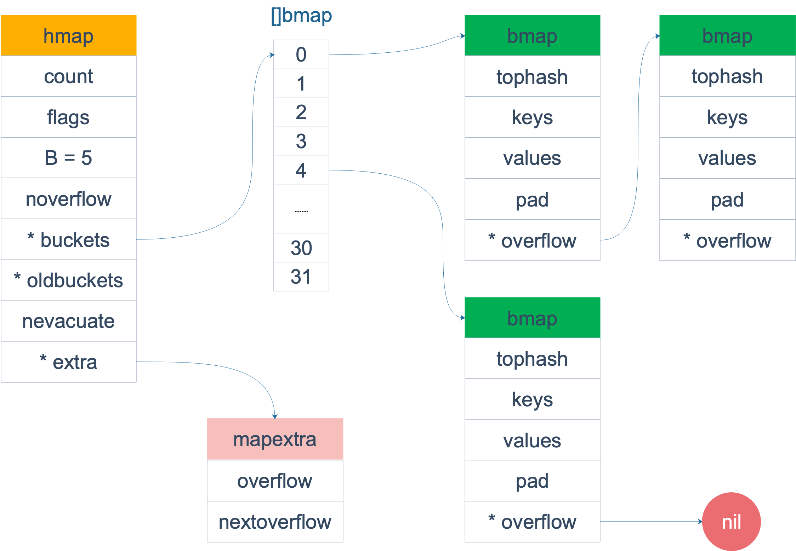

# map
map常用数据结构 哈希查找表,搜索树  
哈希表冲突 链表法,开放链表法 查找效率 最差O(N) 平均O(1) key排序: 乱序 
搜索树（自平衡搜索树）AVL树,红黑树 查找效率 最差O(logN)  key排序: 一般是从小到大

# map底层实现
go 哈希表 链表法解决冲突 
```go
// A header for a Go map.
type hmap struct {
    // 元素个数，调用 len(map) 时，直接返回此值
	count     int
	flags     uint8
	// buckets 的对数 log_2
	B         uint8
	// overflow 的 bucket 近似数
	noverflow uint16
	// 计算 key 的哈希的时候会传入哈希函数
	hash0     uint32
    // 指向 buckets 数组，大小为 2^B
    // 如果元素个数为0，就为 nil
	buckets    unsafe.Pointer
	// 等量扩容的时候，buckets 长度和 oldbuckets 相等
	// 双倍扩容的时候，buckets 长度会是 oldbuckets 的两倍
	oldbuckets unsafe.Pointer
	// 指示扩容进度，小于此地址的 buckets 迁移完成
	nevacuate  uintptr
	extra *mapextra // optional fields
}
```
buckets 是一个指针，最终它指向的是一个结构体：
```go
type bmap struct {
    tophash [bucketCnt]uint8
}
```
但这只是表面(src/runtime/hashmap.go)的结构，编译期间会给它加料，动态地创建一个新的结构：  
一个bmap最多存8个key
```go
type bmap struct { 
    topbits  [8]uint8
    keys     [8]keytype
    values   [8]valuetype
    pad      uintptr
    overflow uintptr
}
```
bamp的key和value是分开存储的

整体结构

slice 和 map 分别作为make函数参数时有什么区别？  
切片返回新的切片结构体
map返回指针
哈希函数选择: cpu支持aes使用aes hash 不支持memhash

# 切片作为函数参数
go函数都是值传递
````go
package main

func main() {
	s := []int{1, 1, 1}
	f(s)
	fmt.Println(s)
}

func f(s []int) {
	// i只是一个副本，不能改变s中元素的值
	/*for _, i := range s {
		i++
	}
	*/

	for i := range s {
		s[i] += 1
	}
}
````
输出  
[2 2 2]
````go
package main

import "fmt"

func myAppend(s []int) []int {
	// 这里 s 虽然改变了，但并不会影响外层函数的 s
	s = append(s, 100)
	return s
}

func myAppendPtr(s *[]int) {
	// 会改变外层 s 本身
	*s = append(*s, 100)
	return
}

func main() {
	s := []int{1, 1, 1}
	newS := myAppend(s)

	fmt.Println(s)
	fmt.Println(newS)

	s = newS

	myAppendPtr(&s)
	fmt.Println(s)
}
````
输出  
[1 1 1]  
[1 1 1 100]  
[1 1 1 100 100]