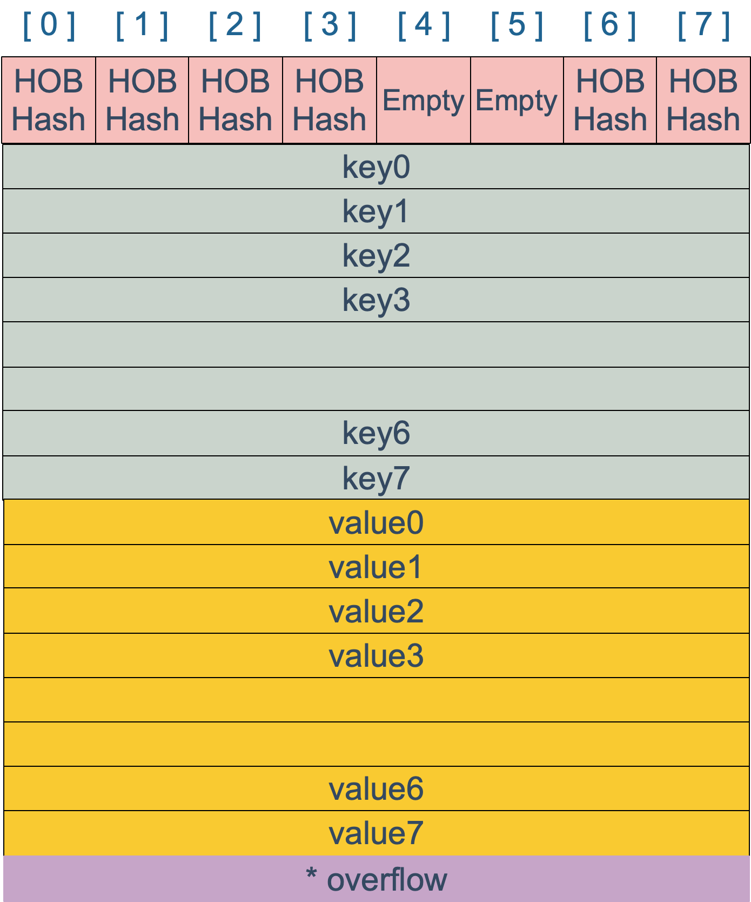

# map
map常用数据结构 哈希查找表,搜索树  
哈希表冲突 链表法,开放链表法 查找效率 最差O(N) 平均O(1) key排序: 乱序 
搜索树（自平衡搜索树）AVL树,红黑树 查找效率 最差O(logN)  key排序: 一般是从小到大

# map底层实现
go 哈希表 链表法解决冲突 
```go
// A header for a Go map.
type hmap struct {
    // 元素个数，调用 len(map) 时，直接返回此值
	count     int
	flags     uint8
	// buckets 的对数 log_2
	B         uint8
	// overflow 的 bucket 近似数
	noverflow uint16
	// 计算 key 的哈希的时候会传入哈希函数
	hash0     uint32
    // 指向 buckets 数组，大小为 2^B
    // 如果元素个数为0，就为 nil
	buckets    unsafe.Pointer
	// 等量扩容的时候，buckets 长度和 oldbuckets 相等
	// 双倍扩容的时候，buckets 长度会是 oldbuckets 的两倍
	oldbuckets unsafe.Pointer
	// 指示扩容进度，小于此地址的 buckets 迁移完成
	nevacuate  uintptr
	extra *mapextra // optional fields
}
```
buckets 是一个指针，最终它指向的是一个结构体：
```go
type bmap struct {
    tophash [bucketCnt]uint8
}
```
但这只是表面(src/runtime/hashmap.go)的结构，编译期间会给它加料，动态地创建一个新的结构：  
一个bmap最多存8个key,会根据 key 计算出来的 hash 值的高 8 位来决定 key 到底落入桶内的哪个位置
```go
type bmap struct { 
    topbits  [8]uint8
    keys     [8]keytype
    values   [8]valuetype
    pad      uintptr
    overflow uintptr
}
```
bamp的key和value是分开存储的

整体结构

slice 和 map 分别作为make函数参数时有什么区别？  
切片返回新的切片结构体
map返回指针
哈希函数选择: cpu支持aes使用aes hash 不支持memhash  
当 map 的 key 和 value 都不是指针，并且 size 都小于 128 字节的情况下，会把 bmap 标记为不含指针
# key定位过程
计算哈希值生成64个bit位  使用最后5位选择对应的桶  使用高8位找到对应的桶位置
# 如何实现两种get操作
两种写法调用的是不同的两个底层函数
# 遍历过程
正常遍历 遍历所有的 bucket 以及它后面挂的 overflow bucket，然后挨个遍历 bucket 中的所有 cell。每个 bucket 中包含 8 个 cell，从有 key 的 cell 中取出 key 和 value，这个过程就完成了。
扩容遍历 以完成扩容的正常遍历，未完成扩容的，要在老 bucket 中找到将来要搬迁到新 bucket 然后按新的来遍历
# 赋值过程
计算key的hash值 找到对应位置 位置为空插入 位置不为空修改
如果 map 处在扩容的过程中，那么当 key 定位到了某个 bucket 后，需要确保这个 bucket 对应的老 bucket 完成了迁移过程。即老 bucket 里的 key 都要迁移到新的 bucket 中来（分裂到 2 个新 bucket），才能在新的 bucket 中进行插入或者更新的操作
在正式安置 key 之前，还要检查 map 的状态，看它是否需要进行扩容。如果满足扩容的条件，就主动触发一次扩容操作。
这之后，整个之前的查找定位 key 的过程，还得再重新走一次。因为扩容之后，key 的分布都发生了变化。
最后，会更新 map 相关的值，如果是插入新 key，map 的元素数量字段 count 值会加 1；在函数之初设置的 hashWriting 写标志出会清零。
# 删除操作
如果h.flags为1 直接panic
计算 key 的哈希，找到落入的 bucket。检查此 map 如果正在扩容的过程中，直接触发一次搬迁操作
最后，将 count 值减 1，将对应位置的 tophash 值置成 Empty
# 扩容操作
装载因子  loadFactor := count / (2^B)
扩容条件   
装载因子超过阈值，源码里定义的阈值是 6.5。 (增加bucket的数量 B+1)
overflow 的 bucket 数量过多：当 B 小于 15，也就是 bucket 总数 2^B 小于 2^15 时，如果 overflow 的 bucket 数量超过 2^B；当 B >= 15，也就是 bucket 总数 2^B 大于等于 2^15，如果 overflow 的 bucket 数量超过 2^15。(新创建一个bucket将老的bucket移动到新的bucket中)
实际扩容过程（渐进式扩容，每次迁移两个bucket）
扩容时机，在插入，修改，删除的时候进行尝试迁移
# 无序key
因为每次扩容key的位置都会改变  
当然，Go 做得更绝，当我们在遍历 map 时，并不是固定地从 0 号 bucket 开始遍历，每次都是从一个随机值序号的 bucket 开始遍历，并且是从这个 bucket 的一个随机序号的 cell 开始遍历。
# float 类型可以作为 map 的 key 吗
从语法上看，是可以的。Go 语言中只要是可比较的类型都可以作为 key。除开 slice，map，functions 这几种类型，其他类型都是 OK 的。具体包括：布尔值、数字、字符串、指针、通道、接口类型、结构体、只包含上述类型的数组。这些类型的共同特征是支持 == 和 != 操作符，k1 == k2 时，可认为 k1 和 k2 是同一个 key。如果是结构体，只有 hash 后的值相等以及字面值相等，才被认为是相同的 key。很多字面值相等的，hash出来的值不一定相等，比如引用。

顺便说一句，任何类型都可以作为 value，包括 map 类型。
NAN特性 NAN!=NAN hash(NAN)!=hash(NAN)
关于当 key 是引用类型时，判断两个 key 是否相等，需要 hash 后的值相等并且 key 的字面量相等。
# 可以边遍历边删除吗
多个线程不行，同一个线程可以，可以通过读写锁解决  
一般而言，这可以通过读写锁来解决：sync.RWMutex。
读之前调用 RLock() 函数，读完之后调用 RUnlock() 函数解锁；写之前调用 Lock() 函数，写完之后，调用 Unlock() 解锁。
另外，sync.Map 是线程安全的 map，也可以使用。
# 可以对 map 的元素取地址吗 
不可以 编译不能通过
# 如何比较两个 map 相等
1、都为 nil
2、非空、长度相等，指向同一个 map 实体对象
3、相应的 key 指向的 value “深度”相等
直接将使用 map1 == map2 是错误的。这种写法只能比较 map 是否为 nil。
因此只能是遍历map 的每个元素，比较元素是否都是深度相等。
# map 是线程安全的吗
map 不是线程安全的。

在查找、赋值、遍历、删除的过程中都会检测写标志，一旦发现写标志置位（等于1），则直接 panic。赋值和删除函数在检测完写标志是复位之后，先将写标志位置位，才会进行之后的操作。