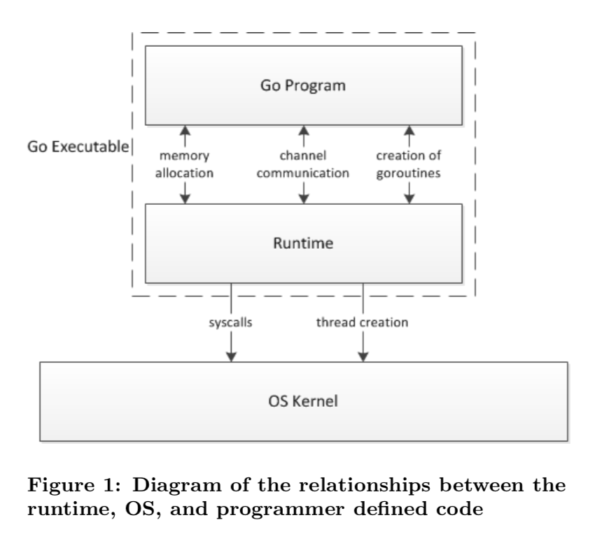
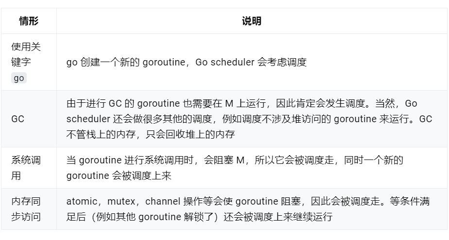
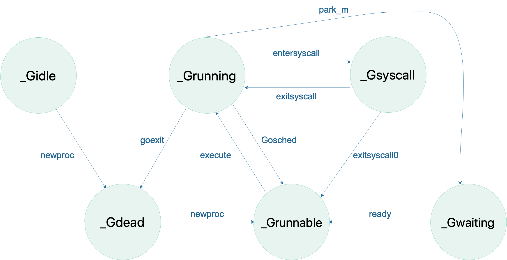
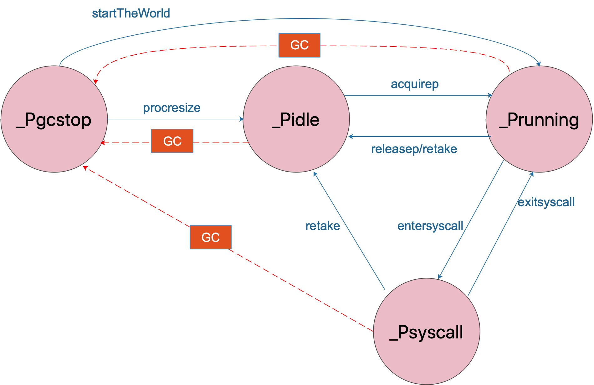
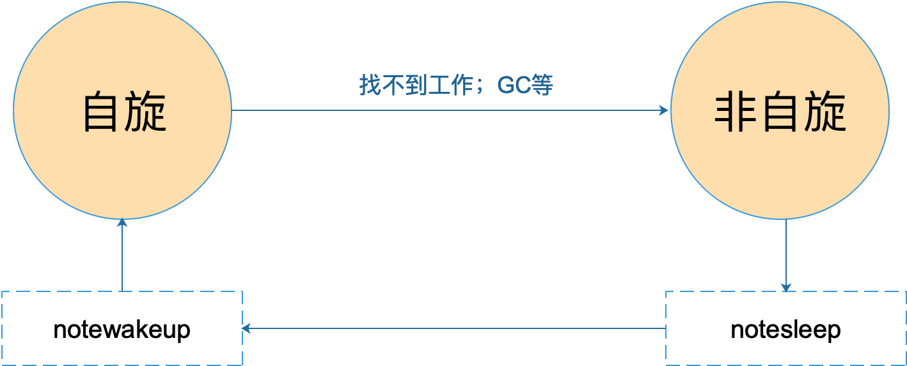
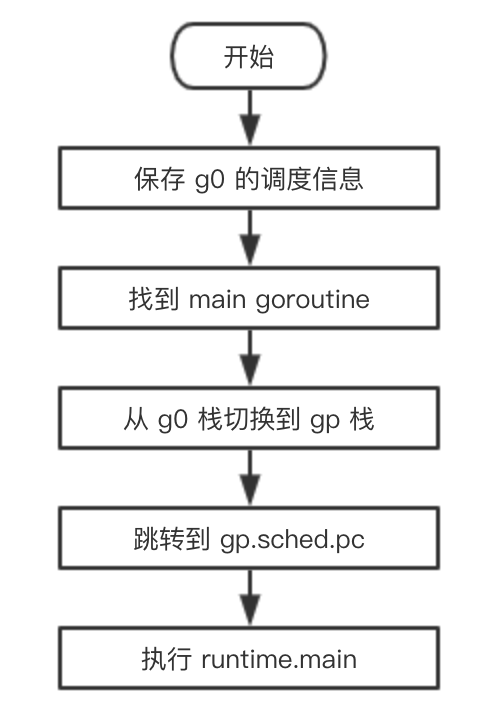
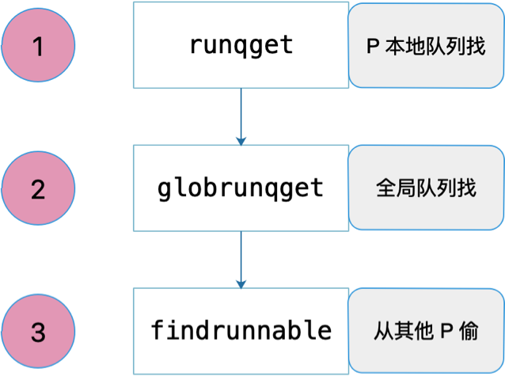

# goroutine 和线程的区别
内存占用 goroutine内存占用少
创建和销毀 Thread 创建和销毀都会有巨大的消耗，因为要和操作系统打交道，是内核级的，通常解决的办法就是线程池。而 goroutine 因为是由 Go runtime 负责管理的，创建和销毁的消耗非常小，是用户级。
切换 因此，goroutines 切换成本比 threads 要小得多。
# 什么是 scheduler
Go 程序的执行由两层组成：Go Program，Runtime，即用户程序和运行时。它们之间通过函数调用来实现内存管理、channel 通信、goroutines 创建等功能。用户程序进行的系统调用都会被 Runtime 拦截，以此来帮助它进行调度以及垃圾回收相关的工作。

# 为什么要 scheduler
Go scheduler 可以说是 Go 运行时的一个最重要的部分了。Runtime 维护所有的 goroutines，并通过 scheduler 来进行调度。Goroutines 和 threads 是独立的，但是 goroutines 要依赖 threads 才能执行。
# scheduler 底层原理
有三个基础的结构体来实现 goroutines 的调度。g，m，p。

g 代表一个 goroutine，它包含：表示 goroutine 栈的一些字段，指示当前 goroutine 的状态，指示当前运行到的指令地址，也就是 PC 值。

m 表示内核线程，包含正在运行的 goroutine 等字段。

p 代表一个虚拟的 Processor，它维护一个处于 Runnable 状态的 g 队列，m 需要获得 p 才能运行 g。
Go scheduler 的核心思想是
reuse threads；
限制同时运行（不包含阻塞）的线程数为 N，N 等于 CPU 的核心数目；
线程私有的 runqueues，并且可以从其他线程 stealing goroutine 来运行，线程阻塞后，可以将 runqueues 传递给其他线程。
全局可运行队列（GRQ）和本地可运行队列（LRQ）。 LRQ 存储本地（也就是具体的 P）的可运行 goroutine，GRQ 存储全局的可运行 goroutine，这些 goroutine 还没有分配到具体的 P。
# goroutine 调度时机有哪些
在四种情形下，goroutine 可能会发生调度，但也并不一定会发生，只是说 Go scheduler 有机会进行调度
 
# 什么是M:N模型
我们都知道，Go runtime 会负责 goroutine 的生老病死，从创建到销毁，都一手包办。Runtime 会在程序启动的时候，创建 M 个线程（CPU 执行调度的单位），之后创建的 N 个 goroutine 都会依附在这 M 个线程上执行。
在同一时刻，一个线程上只能跑一个 goroutine。当 goroutine 发生阻塞（例如上篇文章提到的向一个 channel 发送数据，被阻塞）时，runtime 会把当前 goroutine 调度走，让其他 goroutine 来执行。目的就是不让一个线程闲着，榨干 CPU 的每一滴油水。
# 什么是工作窃取
当一个 P 发现自己的 LRQ 已经没有 G 时，会从其他 P “偷” 一些 G 来运行。看看这是什么精神！自己的工作做完了，为了全局的利益，主动为别人分担。这被称为 Work-stealing，Go 从 1.1 开始实现。
# GPM 是什么
1. G主要保存 goroutine 的一些状态信息以及 CPU 的一些寄存器的值，例如 IP 寄存器，以便在轮到本 goroutine 执行时，CPU 知道要从哪一条指令处开始执行
当 goroutine 被调离 CPU 时，调度器负责把 CPU 寄存器的值保存在 g 对象的成员变量之中。
当 goroutine 被调度起来运行时，调度器又负责把 g 对象的成员变量所保存的寄存器值恢复到 CPU 的寄存器。
2. M它代表一个工作线程，或者说系统线程。G 需要调度到 M 上才能运行，M 是真正工作的人。结构体 m 就是我们常说的 M，它保存了 M 自身使用的栈信息、当前正在 M 上执行的 G 信息、与之绑定的 P 信息……
当 M 没有工作可做的时候，在它休眠前，会“自旋”地来找工作：检查全局队列，查看 network poller，试图执行 gc 任务，或者“偷”工作。
3.  P为 M 的执行提供“上下文”，保存 M 执行 G 时的一些资源，例如本地可运行 G 队列，memeory cache 等。

一个 M 只有绑定 P 才能执行 goroutine，当 M 被阻塞时，整个 P 会被传递给其他 M ，或者说整个 P 被接管。

GPM 三足鼎力，共同成就 Go scheduler。G 需要在 M 上才能运行，M 依赖 P 提供的资源，P 则持有待运行的 G。你中有我，我中有你。
M 会从与它绑定的 P 的本地队列获取可运行的 G，也会从 network poller 里获取可运行的 G，还会从其他 P 偷 G
G流转状态

P 的状态流转：

通常情况下（在程序运行时不调整 P 的个数），P 只会在上图中的四种状态下进行切换。 当程序刚开始运行进行初始化时，所有的 P 都处于 _Pgcstop 状态， 随着 P 的初始化（runtime.procresize），会被置于 _Pidle。

当 M 需要运行时，会 runtime.acquirep 来使 P 变成 Prunning 状态，并通过 runtime.releasep 来释放。

当 G 执行时需要进入系统调用，P 会被设置为 _Psyscall， 如果这个时候被系统监控抢夺（runtime.retake），则 P 会被重新修改为 _Pidle。

如果在程序运行中发生 GC，则 P 会被设置为 _Pgcstop， 并在 runtime.startTheWorld 时重新调整为 _Prunning。
M 的状态变化

M 只有自旋和非自旋两种状态。自旋的时候，会努力找工作；找不到的时候会进入非自旋状态，之后会休眠，直到有工作需要处理时，被其他工作线程唤醒，又进入自旋状态。
# 描述 scheduler 的初始化过程
使用 make([]*p, nprocs) 初始化全局变量 allp，即 allp = make([]*p, nprocs)
循环创建并初始化 nprocs 个 p 结构体对象并依次保存在 allp 切片之中
把 m0 和 allp[0] 绑定在一起，即 m0.p = allp[0]，allp[0].m = m0
把除了 allp[0] 之外的所有 p 放入到全局变量 sched 的 pidle 空闲队列之中
# 主 goroutine 如何创建
# schedule循环如何启动

# M 如何找工作
