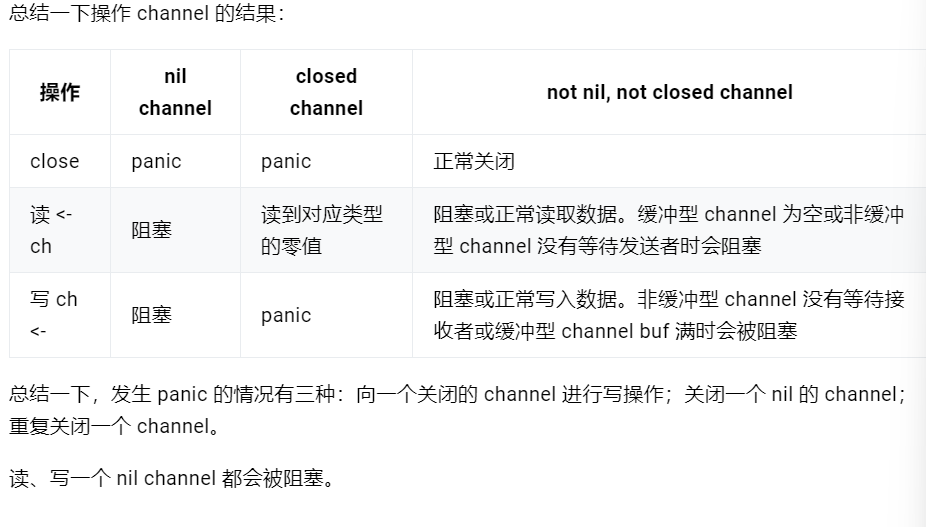

# 什么是CSP
不要通过共享内存来通信，而要通过通信来实现内存共享。
Communicating Sequential Processes(顺序通信进程)
Go 的并发编程的模型则用 goroutine 和 channel 来替代。Goroutine 和线程类似，channel 和 mutex (用于内存同步访问控制)类似。
Channel 则天生就可以和其他 channel 组合。我们可以把收集各种子系统结果的 channel 输入到同一个 channel。Channel 还可以和 select, cancel, timeout 结合起来。而 mutex 就没有这些功能。
Go 的并发原则非常优秀，目标就是简单：尽量使用 channel；把 goroutine 当作免费的资源，随便用。
# channel 底层的数据结构是什么
```go
type hchan struct {
	// chan 里元素数量
	qcount   uint
	// chan 底层循环数组的长度
	dataqsiz uint
	// 指向底层循环数组的指针
	// 只针对有缓冲的 channel
	buf      unsafe.Pointer
	// chan 中元素大小
	elemsize uint16
	// chan 是否被关闭的标志
	closed   uint32
	// chan 中元素类型
	elemtype *_type // element type
	// 已发送元素在循环数组中的索引
	sendx    uint   // send index
	// 已接收元素在循环数组中的索引
	recvx    uint   // receive index
	// 等待接收的 goroutine 队列
	recvq    waitq  // list of recv waiters
	// 等待发送的 goroutine 队列
	sendq    waitq  // list of send waiters

	// 保护 hchan 中所有字段
	lock mutex
}
```
创建chan，内存分配在堆上
# 向 channel 发送数据的过程是怎样的
```go
/ 位于 src/runtime/chan.go

func chansend(c *hchan, ep unsafe.Pointer, block bool, callerpc uintptr) bool {
	// 如果 channel 是 nil
	if c == nil {
		// 不能阻塞，直接返回 false，表示未发送成功
		if !block {
			return false
		}
		// 当前 goroutine 被挂起
		gopark(nil, nil, "chan send (nil chan)", traceEvGoStop, 2)
		throw("unreachable")
	}

	// 省略 debug 相关……

	// 对于不阻塞的 send，快速检测失败场景
	//
	// 如果 channel 未关闭且 channel 没有多余的缓冲空间。这可能是：
	// 1. channel 是非缓冲型的，且等待接收队列里没有 goroutine
	// 2. channel 是缓冲型的，但循环数组已经装满了元素
	if !block && c.closed == 0 && ((c.dataqsiz == 0 && c.recvq.first == nil) ||
		(c.dataqsiz > 0 && c.qcount == c.dataqsiz)) {
		return false
	}

	var t0 int64
	if blockprofilerate > 0 {
		t0 = cputicks()
	}

	// 锁住 channel，并发安全
	lock(&c.lock)

	// 如果 channel 关闭了
	if c.closed != 0 {
		// 解锁
		unlock(&c.lock)
		// 直接 panic
		panic(plainError("send on closed channel"))
	}

	// 如果接收队列里有 goroutine，直接将要发送的数据拷贝到接收 goroutine
	if sg := c.recvq.dequeue(); sg != nil {
		send(c, sg, ep, func() { unlock(&c.lock) }, 3)
		return true
	}

	// 对于缓冲型的 channel，如果还有缓冲空间
	if c.qcount < c.dataqsiz {
		// qp 指向 buf 的 sendx 位置
		qp := chanbuf(c, c.sendx)

		// ……

		// 将数据从 ep 处拷贝到 qp
		typedmemmove(c.elemtype, qp, ep)
		// 发送游标值加 1
		c.sendx++
		// 如果发送游标值等于容量值，游标值归 0
		if c.sendx == c.dataqsiz {
			c.sendx = 0
		}
		// 缓冲区的元素数量加一
		c.qcount++

		// 解锁
		unlock(&c.lock)
		return true
	}

	// 如果不需要阻塞，则直接返回错误
	if !block {
		unlock(&c.lock)
		return false
	}

	// channel 满了，发送方会被阻塞。接下来会构造一个 sudog

	// 获取当前 goroutine 的指针
	gp := getg()
	mysg := acquireSudog()
	mysg.releasetime = 0
	if t0 != 0 {
		mysg.releasetime = -1
	}

	mysg.elem = ep
	mysg.waitlink = nil
	mysg.g = gp
	mysg.selectdone = nil
	mysg.c = c
	gp.waiting = mysg
	gp.param = nil

	// 当前 goroutine 进入发送等待队列
	c.sendq.enqueue(mysg)

	// 当前 goroutine 被挂起
	goparkunlock(&c.lock, "chan send", traceEvGoBlockSend, 3)

	// 从这里开始被唤醒了（channel 有机会可以发送了）
	if mysg != gp.waiting {
		throw("G waiting list is corrupted")
	}
	gp.waiting = nil
	if gp.param == nil {
		if c.closed == 0 {
			throw("chansend: spurious wakeup")
		}
		// 被唤醒后，channel 关闭了。坑爹啊，panic
		panic(plainError("send on closed channel"))
	}
	gp.param = nil
	if mysg.releasetime > 0 {
		blockevent(mysg.releasetime-t0, 2)
	}
	// 去掉 mysg 上绑定的 channel
	mysg.c = nil
	releaseSudog(mysg)
	return true
}
```
# 从 channel 接收数据的过程是怎样的
```go
func chanrecv(c *hchan, ep unsafe.Pointer, block bool) (selected, received bool) {
	// 省略 debug 内容 …………

	// 如果是一个 nil 的 channel
	if c == nil {
		// 如果不阻塞，直接返回 (false, false)
		if !block {
			return
		}
		// 否则，接收一个 nil 的 channel，goroutine 挂起
		gopark(nil, nil, "chan receive (nil chan)", traceEvGoStop, 2)
		// 不会执行到这里
		throw("unreachable")
	}

	// 在非阻塞模式下，快速检测到失败，不用获取锁，快速返回
	// 当我们观察到 channel 没准备好接收：
	// 1. 非缓冲型，等待发送列队 sendq 里没有 goroutine 在等待
	// 2. 缓冲型，但 buf 里没有元素
	// 之后，又观察到 closed == 0，即 channel 未关闭。
	// 因为 channel 不可能被重复打开，所以前一个观测的时候 channel 也是未关闭的，
	// 因此在这种情况下可以直接宣布接收失败，返回 (false, false)
	if !block && (c.dataqsiz == 0 && c.sendq.first == nil ||
		c.dataqsiz > 0 && atomic.Loaduint(&c.qcount) == 0) &&
		atomic.Load(&c.closed) == 0 {
		return
	}

	var t0 int64
	if blockprofilerate > 0 {
		t0 = cputicks()
	}

	// 加锁
	lock(&c.lock)

	// channel 已关闭，并且循环数组 buf 里没有元素
	// 这里可以处理非缓冲型关闭 和 缓冲型关闭但 buf 无元素的情况
	// 也就是说即使是关闭状态，但在缓冲型的 channel，
	// buf 里有元素的情况下还能接收到元素
	if c.closed != 0 && c.qcount == 0 {
		if raceenabled {
			raceacquire(unsafe.Pointer(c))
		}
		// 解锁
		unlock(&c.lock)
		if ep != nil {
			// 从一个已关闭的 channel 执行接收操作，且未忽略返回值
			// 那么接收的值将是一个该类型的零值
			// typedmemclr 根据类型清理相应地址的内存
			typedmemclr(c.elemtype, ep)
		}
		// 从一个已关闭的 channel 接收，selected 会返回true
		return true, false
	}

	// 等待发送队列里有 goroutine 存在，说明 buf 是满的
	// 这有可能是：
	// 1. 非缓冲型的 channel
	// 2. 缓冲型的 channel，但 buf 满了
	// 针对 1，直接进行内存拷贝（从 sender goroutine -> receiver goroutine）
	// 针对 2，接收到循环数组头部的元素，并将发送者的元素放到循环数组尾部
	if sg := c.sendq.dequeue(); sg != nil {
		// Found a waiting sender. If buffer is size 0, receive value
		// directly from sender. Otherwise, receive from head of queue
		// and add sender's value to the tail of the queue (both map to
		// the same buffer slot because the queue is full).
		recv(c, sg, ep, func() { unlock(&c.lock) }, 3)
		return true, true
	}

	// 缓冲型，buf 里有元素，可以正常接收
	if c.qcount > 0 {
		// 直接从循环数组里找到要接收的元素
		qp := chanbuf(c, c.recvx)

		// …………

		// 代码里，没有忽略要接收的值，不是 "<- ch"，而是 "val <- ch"，ep 指向 val
		if ep != nil {
			typedmemmove(c.elemtype, ep, qp)
		}
		// 清理掉循环数组里相应位置的值
		typedmemclr(c.elemtype, qp)
		// 接收游标向前移动
		c.recvx++
		// 接收游标归零
		if c.recvx == c.dataqsiz {
			c.recvx = 0
		}
		// buf 数组里的元素个数减 1
		c.qcount--
		// 解锁
		unlock(&c.lock)
		return true, true
	}

	if !block {
		// 非阻塞接收，解锁。selected 返回 false，因为没有接收到值
		unlock(&c.lock)
		return false, false
	}

	// 接下来就是要被阻塞的情况了
	// 构造一个 sudog
	gp := getg()
	mysg := acquireSudog()
	mysg.releasetime = 0
	if t0 != 0 {
		mysg.releasetime = -1
	}

	// 待接收数据的地址保存下来
	mysg.elem = ep
	mysg.waitlink = nil
	gp.waiting = mysg
	mysg.g = gp
	mysg.selectdone = nil
	mysg.c = c
	gp.param = nil
	// 进入channel 的等待接收队列
	c.recvq.enqueue(mysg)
	// 将当前 goroutine 挂起
	goparkunlock(&c.lock, "chan receive", traceEvGoBlockRecv, 3)

	// 被唤醒了，接着从这里继续执行一些扫尾工作
	if mysg != gp.waiting {
		throw("G waiting list is corrupted")
	}
	gp.waiting = nil
	if mysg.releasetime > 0 {
		blockevent(mysg.releasetime-t0, 2)
	}
	closed := gp.param == nil
	gp.param = nil
	mysg.c = nil
	releaseSudog(mysg)
	return true, !closed
}

```
M、P、G。M 是内核线程，负责运行 goroutine；P 是 context，保存 goroutine 运行所需要的上下文，它还维护了可运行（runnable）的 goroutine 列表；G 则是待运行的 goroutine。M 和 P 是 G 运行的基础。
# 关闭一个 channel 的过程是怎样的
```go
func closechan(c *hchan) {
	// 关闭一个 nil channel，panic
	if c == nil {
		panic(plainError("close of nil channel"))
	}

	// 上锁
	lock(&c.lock)
	// 如果 channel 已经关闭
	if c.closed != 0 {
		unlock(&c.lock)
		// panic
		panic(plainError("close of closed channel"))
	}

	// …………

	// 修改关闭状态
	c.closed = 1

	var glist *g

	// 将 channel 所有等待接收队列的里 sudog 释放
	for {
		// 从接收队列里出队一个 sudog
		sg := c.recvq.dequeue()
		// 出队完毕，跳出循环
		if sg == nil {
			break
		}

		// 如果 elem 不为空，说明此 receiver 未忽略接收数据
		// 给它赋一个相应类型的零值
		if sg.elem != nil {
			typedmemclr(c.elemtype, sg.elem)
			sg.elem = nil
		}
		if sg.releasetime != 0 {
			sg.releasetime = cputicks()
		}
		// 取出 goroutine
		gp := sg.g
		gp.param = nil
		if raceenabled {
			raceacquireg(gp, unsafe.Pointer(c))
		}
		// 相连，形成链表
		gp.schedlink.set(glist)
		glist = gp
	}

	// 将 channel 等待发送队列里的 sudog 释放
	// 如果存在，这些 goroutine 将会 panic
	for {
		// 从发送队列里出队一个 sudog
		sg := c.sendq.dequeue()
		if sg == nil {
			break
		}

		// 发送者会 panic
		sg.elem = nil
		if sg.releasetime != 0 {
			sg.releasetime = cputicks()
		}
		gp := sg.g
		gp.param = nil
		if raceenabled {
			raceacquireg(gp, unsafe.Pointer(c))
		}
		// 形成链表
		gp.schedlink.set(glist)
		glist = gp
	}
	// 解锁
	unlock(&c.lock)

	// Ready all Gs now that we've dropped the channel lock.
	// 遍历链表
	for glist != nil {
		// 取最后一个
		gp := glist
		// 向前走一步，下一个唤醒的 g
		glist = glist.schedlink.ptr()
		gp.schedlink = 0
		// 唤醒相应 goroutine
		goready(gp, 3)
	}
}
```
# 从一个关闭的 channel 仍然能读出数据吗
从一个有缓冲的 channel 里读数据，当 channel 被关闭，依然能读出有效值。只有当返回的 ok 为 false 时，读出的数据才是无效的。
# 操作 channel 的情况总结

# 如何优雅地关闭 channel
有两个不那么优雅地关闭 channel 的方法：  

使用 defer-recover 机制，放心大胆地关闭 channel 或者向 channel 发送数据。即使发生了 panic，有 defer-recover 在兜底。  

使用 sync.Once 来保证只关闭一次。
根据 sender 和 receiver 的个数，分下面几种情况：

一个 sender，一个 receiver
一个 sender， M 个 receiver
N 个 sender，一个 reciver
N 个 sender， M 个 receiver
对于 1，2，只有一个 sender 的情况就不用说了，直接从 sender 端关闭就好了，没有问题
第 3 种情形下，优雅关闭 channel 的方法是：解决方案就是增加一个传递关闭信号的 channel，receiver 通过信号 channel 下达关闭数据 channel 指令。senders 监听到关闭信号后，停止发送数据。
```go
func main() {
	rand.Seed(time.Now().UnixNano())

	const Max = 100000
	const NumSenders = 1000

	dataCh := make(chan int, 100)
	stopCh := make(chan struct{})

	// senders
	for i := 0; i < NumSenders; i++ {
		go func() {
			for {
				select {
				case <- stopCh:
					return
				case dataCh <- rand.Intn(Max):
				}
			}
		}()
	}

	// the receiver
	go func() {
		for value := range dataCh {
			if value == Max-1 {
				fmt.Println("send stop signal to senders.")
				close(stopCh)
				return
			}

			fmt.Println(value)
		}
	}()

	select {
	case <- time.After(time.Hour):
	}
}
```
最后一种情况，优雅关闭 channel 的方法是:和第 3 种情况不同，这里有 M 个 receiver，如果直接还是采取第 3 种解决方案，由 receiver 直接关闭 stopCh 的话，就会重复关闭一个 channel，导致 panic。因此需要增加一个中间人，M 个 receiver 都向它发送关闭 dataCh 的“请求”，中间人收到第一个请求后，就会直接下达关闭 dataCh 的指令（通过关闭 stopCh，这时就不会发生重复关闭的情况，因为 stopCh 的发送方只有中间人一个）。另外，这里的 N 个 sender 也可以向中间人发送关闭 dataCh 的请求。
```go
func main() {
	rand.Seed(time.Now().UnixNano())

	const Max = 100000
	const NumReceivers = 10
	const NumSenders = 1000

	dataCh := make(chan int, 100)
	stopCh := make(chan struct{})

	// It must be a buffered channel.
	toStop := make(chan string, 1)

	var stoppedBy string

	// moderator
	go func() {
		stoppedBy = <-toStop
		close(stopCh)
	}()

	// senders
	for i := 0; i < NumSenders; i++ {
		go func(id string) {
			for {
				value := rand.Intn(Max)
				if value == 0 {
					select {
					case toStop <- "sender#" + id:
					default:
					}
					return
				}

				select {
				case <- stopCh:
					return
				case dataCh <- value:
				}
			}
		}(strconv.Itoa(i))
	}

	// receivers
	for i := 0; i < NumReceivers; i++ {
		go func(id string) {
			for {
				select {
				case <- stopCh:
					return
				case value := <-dataCh:
					if value == Max-1 {
						select {
						case toStop <- "receiver#" + id:
						default:
						}
						return
					}

					fmt.Println(value)
				}
			}
		}(strconv.Itoa(i))
	}

	select {
	case <- time.After(time.Hour):
	}

}
```
不要从一个 receiver 侧关闭 channel，也不要在有多个 sender 时，关闭 channel。
# channel 发送和接收元素的本质是什么
就是说 channel 的发送和接收操作本质上都是 “值的拷贝”，无论是从 sender goroutine 的栈到 chan buf，还是从 chan buf 到 receiver goroutine，或者是直接从 sender goroutine 到 receiver goroutine。
# channel 在什么情况下会引起资源泄漏
Channel 可能会引发 goroutine 泄漏。

泄漏的原因是 goroutine 操作 channel 后，处于发送或接收阻塞状态，而 channel 处于满或空的状态，一直得不到改变。同时，垃圾回收器也不会回收此类资源，进而导致 gouroutine 会一直处于等待队列中，不见天日。

另外，程序运行过程中，对于一个 channel，如果没有任何 goroutine 引用了，gc 会对其进行回收操作，不会引起内存泄漏。
# 关于 channel 的 happened-before 有哪些
简单来说就是如果事件 a 和事件 b 存在 happened-before 关系，即 a -> b，那么 a，b 完成后的结果一定要体现这种关系。由于现代编译器、CPU 会做各种优化，包括编译器重排、内存重排等等，在并发代码里，happened-before 限制就非常重要了。
根据晃岳攀老师在 Gopher China 2019 上的并发编程分享，关于 channel 的发送（send）、发送完成（send finished）、接收（receive）、接收完成（receive finished）的 happened-before 关系如下：

第 n 个 send 一定 happened before 第 n 个 receive finished，无论是缓冲型还是非缓冲型的 channel。
对于容量为 m 的缓冲型 channel，第 n 个 receive 一定 happened before 第 n+m 个 send finished。
对于非缓冲型的 channel，第 n 个 receive 一定 happened before 第 n 个 send finished。
channel close 一定 happened before receiver 得到通知。
# channel 有哪些应用
停止信号
任务定时
```go
select {
	case <-time.After(100 * time.Millisecond):
	case <-s.stopc:
		return false
}
```
等待 100 ms 后，如果 s.stopc 还没有读出数据或者被关闭，就直接结束。
```go
func worker() {
	ticker := time.Tick(1 * time.Second)
	for {
		select {
		case <- ticker:
			// 执行定时任务
			fmt.Println("执行 1s 定时任务")
		}
	}
}
```
每隔 1 秒种，执行一次定时任务。
解耦生产方和消费方
```go
func main() {
	taskCh := make(chan int, 100)
	go worker(taskCh)

    // 塞任务
	for i := 0; i < 10; i++ {
		taskCh <- i
	}

    // 等待 1 小时 
	select {
	case <-time.After(time.Hour):
	}
}

func worker(taskCh <-chan int) {
	const N = 5
	// 启动 5 个工作协程
	for i := 0; i < N; i++ {
		go func(id int) {
			for {
				task := <- taskCh
				fmt.Printf("finish task: %d by worker %d\n", task, id)
				time.Sleep(time.Second)
			}
		}(i)
	}
}
```
5 个工作协程在不断地从工作队列里取任务，生产方只管往 channel 发送任务即可，解耦生产方和消费方
控制并发数 
```go
var limit = make(chan int, 3)

func main() {
    // …………
    for _, w := range work {
        go func() {
            limit <- 1
            w()
            <-limit
        }()
    }
    // …………
}
```
构建一个缓冲型的 channel，容量为 3。接着遍历任务列表，每个任务启动一个 goroutine 去完成。真正执行任务，访问第三方的动作在 w() 中完成，在执行 w() 之前，先要从 limit 中拿“许可证”，拿到许可证之后，才能执行 w()，并且在执行完任务，要将“许可证”归还。这样就可以控制同时运行的 goroutine 数。

这里，limit <- 1 放在 func 内部而不是外部，原因是：

如果在外层，就是控制系统 goroutine 的数量，可能会阻塞 for 循环，影响业务逻辑。

limit 其实和逻辑无关，只是性能调优，放在内层和外层的语义不太一样。

还有一点要注意的是，如果 w() 发生 panic，那“许可证”可能就还不回去了，因此需要使用 defer 来保证。