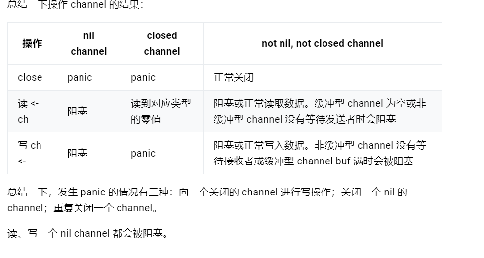

# golang 中 make 和 new 的区别？
共同的:给变量分配内存  
不同点: 
1. 作用的变量类型不同，new(string,int,数组) make(切片,map,channel)分配内存
2. 返回类型不一样，new返回指针，make返回变量本身
3. new只会分配内存，make除了分配内存还会初始化对应的变量
# 变量分配的位置
未逃逸的变量分配在栈上，逃逸的变量分配在堆上
# 数组和切片的区别
定义方式不一样，初始化方式不一样（数组需要指定大小，并且大小不能改变），在函数传递中数组切片都是值传递
# for range 的时候它的地址会发生变化么
不会，他的地址不会改变，改变的只是地址上的值
# go defer，多个 defer 的顺序，defer 在什么时机会修改返回值？
defer延迟函数，主要用来释放资源，收尾工作，捕获panic  
多个defer是先入后出的顺序执行  
执行顺序: reture,reture value,defer
# uint 类型
byte类型是uint8的别名，表示一个字节，常用来处理ascii字符
# rune 类型
rune类型是Go语言中的一个基本类型，其实就是一个int32的别名，主要用于表示一个字符类型大于一个字节小于等于4个字节的情况下，特别是中文字符
因为中文字符在unicode下占2个字节，在utf-8编码下占3个字节，而golang默认编码正好是utf-8
# golang 中解析 tag 是怎么实现的？反射原理是什么？
是通过反射进行实现的  
反射定义: 是只程序运行时，可以访问和修改本身状态或行为的一种能力。
反射原理: 当向接口变量赋予一个实体类型的时候，接口会存储实体的类型信息（实际存储的地址），反射就是通过接口的类型信息实现的，反射建立在类型的基础上
反射包: reflect
过程：接口变量->反射对象（Type,Value）->反射对象（Value）->接口变量
# 调用函数传入结构体时，应该传值还是指针？
传值
函数传递实际是把调用是传递的参数值复制一份传递到函数中，这样在函数中修改参数，并不会影响实际参数  
对于go来说,函数传递的都是值，不过值是分为两种，值类型和引用类型  
所谓值类型：变量和变量的值存在同一个位置(函数传递的是值)  
所谓引用类型：变量和变量的值是不同的位置，变量的值存储的是对值的引用(函数传递的是地址)
如果传递的是地址的话，修改地址上对应的值的话，是会改变实际传入的参数的
# Go 的 slice 底层数据结构和一些特性
go切片的底层由数组指针，len,cap组成，在通过append函数向切片添加数据时，当容量不足时，会先扩容得到新的切片，然后在将新元素添加进去，然后返回新的slice
扩容规则:小于1024 2倍 ，大于1024 1.25倍，由于内存对齐，实际的值是会比这个大一些 
# Go 的 select 底层数据结构和一些特性
多路IO复用，通过一个协程同时处理多个IO请求（channel读写事件）  
通过多个case监听多个Channel的读写操作，任何一个case可以执行则选择该case执行，否则执行default  没有default,goroutine阻塞  
底层数据结构（无）只有一个runtime.scase结构体 表示每个case语句
```go
type scase struct {
  c    *hchan         // case中使用的chan
  elem unsafe.Pointer // 指向case包含数据的指针
}
```  
特性:
1）select 操作至少要有一个 case 语句，出现读写 nil 的 channel 该分支会忽略，在 nil 的 channel 上操作则会报错。

2）select 仅支持管道，而且是单协程操作。

3）每个 case 语句仅能处理一个管道，要么读要么写。

4）多个 case 语句的执行顺序是随机的。

5）存在 default 语句，select 将不会阻塞，但是存在 default 会影响性能。
使用:
并发控制，超时控制，定时任务，解耦生产和消费方
# Go 的 defer 底层数据结构和一些特性？
每个defer都对应一个_defer实例，多个实例使用指针连接形成一个单链表，使用头插法，保存在goroutine中,函数结束时从头到尾依次执行
特性  
延迟函数的参数是 defer 语句出现的时候就已经确定了的。

延迟函数执行按照后进先出的顺序执行，即先出现的 defer 最后执行。

延迟函数可能操作主函数的返回值。

申请资源后立即使用 defer 关闭资源是个好习惯。
# 单引号，双引号，反引号的区别
单引号：表示byte或者rune类型 int8，int32
双引号：字符串
反引号：字符串字面量
# map 使用注意的点，是否并发安全
1. 使用前要先初始化，否则会panic
2. map不是并发安全的出现并发也会panic（并发map sync.Map 读写锁）
3. map的key是要可以比较类型（并且要不可变）
4. map遍历是无序的（扩容时会重新hash,导致key的位置变化，并在go的map遍历也是随机的）
5. map[key]可以返回一个值也可以返回两个值
# map 中删除一个 key，它的内存会释放么
不会，只有map为nil才会
# nil map 和空 map 有何不同
nil map是未初始化 空map是初始化了，但长度为空
# map 的数据结构是什么？是怎么实现扩容？
map是一个kv集合，底层使用哈希表，解决冲突使用拉链发，存储使用bmap,每个bmap可以存放8个kv,只有存储满了以后才会使用链表串联起来(k,v是分开存放，key存在一起，v存在一起)  
hash函数 cpu支持aes使用aes，不支持使用memhash
map底层结构hmap由多个bmap组成
```go
type hmap struct {
    count     int                  // 元素个数
    flags     uint8
    B         uint8                // 扩容常量相关字段B是buckets数组的长度的对数 2^B
    noverflow uint16               // 溢出的bucket个数
    hash0     uint32               // hash seed
    buckets    unsafe.Pointer      // buckets 数组指针
    oldbuckets unsafe.Pointer      // 结构扩容的时候用于赋值的buckets数组
    nevacuate  uintptr             // 搬迁进度
    extra *mapextra                // 用于扩容的指针
}
```
key的低B位选择桶，高8位选择槽
# map 的容量大小
2^B个元素 6.5为装载因子 装载因子=元素个数/散列表长度 
# 触发 map 扩容的条件
装载因子超过6.5  
overflow的bucket数量过多，当 B 小于 15，也就是 bucket 总数 2^B 小于 2^15 时，如果 overflow 的 bucket 数量超过 2^B；当 B >= 15，也就是 bucket 总数 2^B 大于等于 2^15，如果 overflow 的 bucket 数量超过 2^15。
# slices能作为map类型的key吗
除了slices，map,functions其他的类型都可以
# context 结构是什么样的？context 使用场景和用途？
结构（Deadline,Done,Err,Value）
Deadline 返回time.Time,结束事件
Done取消时返回一个close的channel表示需要结束
Err context取消的原因
Value共享数据（协程安全）
用途：（上下文控制，多个goroutine数据交互，超时控制）
# channel 是否线程安全？锁用在什么地方
是
锁主要用在并发读写
# channel 的底层实现原理 
buf ,发送队列，接收队列，lock
# nil、关闭的 channel、有数据的 channel，再进行读、写、关闭会怎么样？

# 向 channel 发送数据和从 channel 读数据的流程是什么样的？
# channel数据结构
qccount当前队列剩余的元素个数
dataqsize环形队列长度，可以存放的元素个数
buf环形队列指针
elemsize每个元素大小
closed关闭状态
elemtype元素类型
sendx队列下标写
recv队列下表读
recvq 等待读消息的goroutine 队列
sendq 等待写消息的 goroutine 队列
lock 互斥锁
# 无缓冲和有缓冲区别
无缓冲：无数据，读阻塞。有数据，写阻塞。
有缓冲：无数据，读阻塞。数据满，写阻塞。
# 写流程
等待接收队列 recvq 不为空，缓冲区为空，或者没有缓冲区，取出G写数据，唤醒G,结束。
缓冲区有位置，写入缓冲区，结束。无位置,将数据写入G,并将G加入sendq，进入睡眠，等待被唤醒
# 读流程
如果等待发送队列 sendq 不为空，且没有缓冲区，直接从 sendq 中取出 G，把 G 中数据读出，最后把 G 唤醒，结束读取过程；
如果等待发送队列 sendq 不为空，此时说明缓冲区已满，从缓冲区中首部读出数据，把 G 中数据写入缓冲区尾部，把 G 唤醒，结束读取过程；
如果缓冲区中有数据，则从缓冲区取出数据，结束读取过程；将当前 goroutine 加入 recvq，进入睡眠，等待被写 goroutine 唤醒；
# 使用场景
消息传递、消息过滤，信号广播，事件订阅与广播，请求、响应转发，任务分发，结果汇总，并发控制，限流，同步与异步
# 什么是 GMP？
G goroutine
P 上下文处理器
M 线程
全局队列，存放等待运行的G,
本地队列，存放等待运行的G,但有限，不超过256个
创建G，优先保存P的本地队列，如果本地队列满了，存全局队列。
M从P中选一个可执行的G运行，如果P为空，从其他的MP中偷一个G运行(工作窃取)
当M运行G时，M阻塞G在运行，会去除这个M,新建一个系统线程给P,当M阻塞结束,G会尝试获取一个空闲的P来运行，并加入P的本地队列，如果M空闲，加入空闲线程，然后G会放到全局队列中
G理论上无限个，受内存控制，P一般是逻辑CPU2倍，M默认10000.M一般大于P
# 进程、线程、协程有什么区别？
进程：是应用程序的启动实例，每个进程都有独立的内存空间，不同的进程通过进程间的通信方式来通信。

线程：从属于进程，每个进程至少包含一个线程，线程是 CPU 调度的基本单位，多个线程之间可以共享进程的资源并通过共享内存等线程间的通信方式来通信。

协程：为轻量级线程，与线程相比，协程不受操作系统的调度，协程的调度器由用户应用程序提供，协程调度器按照调度策略把协程调度到线程中运行
# 协作式调度、信号量调度
协作式调度，会让程序顺利的完成自己的任务，再把资源腾出来给其他程序使用
占式调度，也就是让程序按一定的时间去占有这些资源，时间到了就被迫让出现有资源，给其他的程序轮流使用。
go基于协助的抢占式调度
在下面的事件发生时进行调度触发：
1. 使用关键字 go
2. 垃圾回收
3. 系统调用，如访问硬盘
4. 同步阻塞调用，如 使用 mutex、channel
   如果上面什么事件都没发生，则会有 sysmon 来监控 goroutine 的运行情况，对长时间运行的 goroutine 进行标记。一旦 goroutine 被标记了，那么它就会下次发生函数调用时，将自己挂起，再触发调度。
# M 和 P 的数量问题？
p默认cpu内核数

M与P的数量没有绝对关系，一个M阻塞，P就会去创建或者切换另一个M，所以，即使P的默认数量是1，也有可能会创建很多个M出来
# 除了 mutex 以外还有那些方式安全读写共享变量
* 将共享变量的读写放到一个 goroutine 中，其它 goroutine 通过 channel 进行读写操作。

* 可以用个数为 1 的信号量（semaphore）实现互斥

* 通过 Mutex 锁实现
# Go 如何实现原子操作
Go 语言的标准库代码包 sync/atomic 提供了原子的读取（Load 为前缀的函数）或写入（Store 为前缀的函数）某个值（这里细节还要多去查查资料）。
# 原子操作与互斥锁的区别
1）、互斥锁是一种数据结构，用来让一个线程执行程序的关键部分，完成互斥的多个操作。

2）、原子操作是针对某个值的单个互斥操作。
# Mutex 是悲观锁还是乐观锁？悲观锁、乐观锁是什么？
悲观锁
悲观锁：操作数据先锁定在修改
乐观锁：写锁定，读不锁定
# Mutex 有几种模式
正常模式：
当mutex只有一个G获取，没有竞争直接返回
新的G进入，mutex已经被获取，G进入等待队列，在mutex释放后，按队列获取锁。该G自旋状态。
新的G进入，mutex空闲，参与竞争。如果等待队列的G获取不到锁，超过1毫秒。Mutex进入饥饿模式。
饥饿模式：
在饥饿模式下，Mutex 的拥有者将直接把锁交给队列最前面的 waiter。新G不会尝试获取锁，即使看起来锁没有被持有，它也不会去抢，也不会 spin（自旋），它会乖乖地加入到等待队列的尾部。 如果拥有 Mutex 的 waiter 发现下面两种情况的其中之一，它就会把这个 Mutex 转换成正常模式:
此 waiter 已经是队列中的最后一个 waiter 了，没有其它的等待锁的 goroutine 了；
此 waiter 的等待时间小于 1 毫秒。
# goroutine 的自旋占用资源如何解决
自旋的条件如下：还没自旋超过 4 次,多核处理器， GOMAXPROCS > 1， p 上本地 goroutine 队列为空。
mutex 会让当前的 goroutine 去空转 CPU，在空转完后再次调用 CAS 方法去尝试性的占有锁资源，直到不满足自旋条件，则最终会加入到等待队列里。


        


