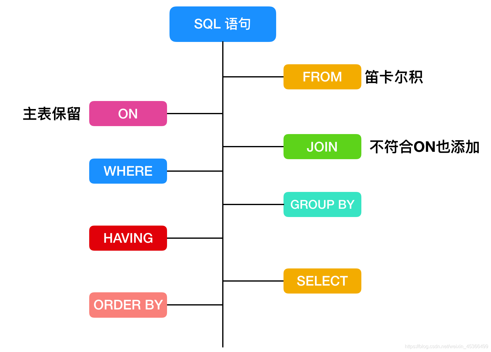

## 为什么建表时，加 not null default '' 或 default 0
不想让表中出现null值
## 为什么不想要 null 的值
1. 不好比较。null是一种特殊值，比较时只能用专门的is null 和 is not null来比较。碰到运算符，通常返回null
2. 效率不高。影响提高索引效果。因此，我们往往在建表时 not null default '' 或 default 0
3. null 值会占用更多的字节，且会在程序中造成很多与预期不符的情况。
## 带AUTO_INCREMENT约束的字段值是从1开始的吗？
在MySQL中，默认AUTO_INCREMENT的初始值是1，每新增一条记录，字段值自动加1。设置自增属性（AUTO_INCREMENT）的时候，还可以指定第一条插入记录的自增字段的值，这样新插入的记录的自增字段值从初始值开始递增，如在表中插入第一条记录，同时指定id值为5，则以后插入的记录的id值就会从6开始往上增加。添加主键约束时，往往需要设置字段自动增加属性。
## 并不是每个表都可以任意选择存储引擎？
外键约束（FOREIGN KEY）不能跨引擎使用。  
MySQL支持多种存储引擎，每一个表都可以指定一个不同的存储引擎，需要注意的是：外键约束是用来保证数据的参照完整性的，如果表之间需要关联外键，却指定了不同的存储引擎，那么这些表之间是不能创建外键约束的。所以说，存储引擎的选择也不完全是随意的。
# 索引
## 什么是索引
索引是一种数据结构，帮助我们快速进行数据查找
## 索引是个什么样的数据结构呢?
常用索引：Hash索引，B+树索引等（InnoDB）
## 为什么使用索引
唯一性索引保证数据唯一性
加快数据查找速度
避免服务器排序和临时表
将随机I/O变为顺序I/O
加速表和表之间的连接
## Innodb为什么要用自增id作为主键？
如果表使用自增主键，那么每次插入新的记录，记录就会顺序添加到当前索引节点的后续位置，当一页写满，就会自动开辟一个新的页。如果使用非自增主键（如果身份证号或学号等），由于每次插入主键的值近似于随机，因此每次新纪录都要被插到现有索引页得中间某个位置， 频繁的移动、分页操作造成了大量的碎片，得到了不够紧凑的索引结构，后续不得不通过OPTIMIZE TABLE（optimize table）来重建表并优化填充页面。
## Hash 索引和 B+ 树索引有什么区别或者说优劣呢?
Hash索引（hash表）：对于等值查找更快，但是无法进行范围查询和使用索引排序，不支持模糊查询和最左匹配。并且无法避免回表，并且在hash查找不稳定
B+树（多路平衡查找树）：查找比较稳定，符合某些条件(聚簇索引,覆盖索引等)的时候可以只通过索引完成查询
因此，在大多数情况下，直接选择 B+ 树索引可以获得稳定且较好的查询速度。而不需要使用 hash 索引。
## 聚簇索引
叶子节点存储数据
## 索引的底层实现
Hash索引
基于哈希表实现，只有精确匹配索引所有列的查询才有效，对于每一行数据，存储引擎都会对所有的索引列计算一个哈希码（hash code），并且Hash索引将所有的哈希码存储在索引中，同时在索引表中保存指向每个数据行的指针。
B-Tree索引（MySQL使用B+Tree）
数据都在叶子节点上，并且增加了顺序访问指针，每个叶子节点都指向相邻的叶子节点的地址。
n棵子tree的节点包含n个关键字，不用来保存数据而是保存数据的索引。
所有的叶子结点中包含了全部关键字的信息，及指向含这些关键字记录的指针，且叶子结点本身依关键字的大小自小而大顺序链接。
所有的非终端结点可以看成是索引部分，结点中仅含其子树中的最大（或最小）关键字。
B+ 树中，数据对象的插入和删除仅在叶节点上进行。
B+树有2个头指针，一个是树的根节点，一个是最小关键码的叶节点。
## 索引的优点
加快查找效率，提高系统性能
## 索引的缺点
创建和维护索引需要消耗时间，对数据增删改查会使用更多的时间，同时需要使用额外的物理空间
## 聚簇索引和非聚簇索引的区别
聚簇索引：数据和叶子节点存储在一起
非聚簇索引：叶子节点记录主键或者地址
## MyISAM和InnoDB实现B+树索引方式的区别是什么？
MyISAM地址
InnoDB主键数据，其他是主键
## 其他
在根据主键索引搜索时，直接找到key所在的节点即可取出数据；根据辅助索引查找时，则需要先取出主键的值，再走一遍主索引。 因此，在设计表的时候，不建议使用过长的字段为主键，也不建议使用非单调的字段作为主键，这样会造成主索引频繁分裂。
总结：InnoDB 主键索引使用的是聚簇索引，MyISAM 不管是主键索引，还是二级索引使用的都是非聚簇索引。
## MySQL中有几种索引类型，可以简单说说吗？
全文索引，hash索引，BTree,RTree
## 覆盖索引是什么？
如果一个索引包含（或者说覆盖）所有需要查询的字段的值，我们就称 之为“覆盖索引”。
覆盖索引就是把要查询出的列和索引是对应的，不做回表操作！
## 非聚簇索引一定会回表查询吗?
覆盖索引
## 联合索引是什么?为什么需要注意联合索引中的顺序?
MySQL 可以使用多个字段同时建立一个索引，叫做联合索引。
在联合索引中，如果想要命中索引，需要按照建立索引时的字段顺序挨个使用，否则无法命中索引。
## 创建的索引有没有被使用到?或者说怎么才可以知道这条语句运行很慢的原因?
explain 命令来查看语句的执行计划
id ：编号
select_type ：查询类型
table ：表
type ：类型
possible_keys ：预测用到的索引
key ：实际使用的索引
key_len ：实际使用索引的长度
ref ：表之间的引用
rows ：通过索引查询到的数据量
Extra ：额外的信息
## 那么在哪些情况下会发生针对该列创建了索引但是在查询的时候并没有使用呢?
使用不等于查询
列参与了数学运算或者函数
在字符串 like 时左边是通配符。类似于’%aaa’。
当 mysql 分析全表扫描比使用索引快的时候不使用索引。
当使用联合索引，前面一个条件为范围查询，后面的即使符合最左前缀原则，也无法使用索引。
## 为什么Mysql用B+树做索引而不用B-树或红黑树、二叉树
主要原因：B+树只要遍历叶子节点就可以实现整棵树的遍历，而且在数据库中基于范围的查询是非常频繁的，而B树只能中序遍历所有节点，效率太低。
## MySQL索引种类
普通索引、唯一索引(主键索引、唯一索引)、联合索引、全文索引、空间索引
## 索引在什么情况下遵循最左前缀的规则？
在建立了联合索引的前提条件下，数据库会一直从左向右的顺序依次查找，直到遇到了范围查询(>,<,between,like等)
# 事务相关
## 什么是事务?
ACID
A=Atomicity：原子性，就是要么全部成功，要么全部失败。不可能只执行一部分操作。
C=Consistency：一致性，系统(数据库)总是从一个一致性的状态转移到另一个一致性的状态，不会存在中间状态。
I=Isolation：隔离性，通常来说：一个事务在完全提交之前，对其他事务是不可见的.注意前面的通常来说加了红色，意味着有例外情况。
D=Durability：持久性，一旦事务提交，那么就永远是这样子了，哪怕系统崩溃也不会影响到这个事务的结果。
## MySQL中为什么要有事务回滚机制？
而在 MySQL 中，恢复机制是通过回滚日志（undo log）实现的，所有事务进行的修改都会先记录到这个回滚日志中，然后在对数据库中的对应行进行写入。当事务已经被提交之后，就无法再次回滚了。
能够在发生错误或者用户执行 ROLLBACK 时提供回滚相关的信息
在整个系统发生崩溃、数据库进程直接被杀死后，当用户再次启动数据库进程时，还能够立刻通过查询回滚日志将之前未完成的事务进行回滚，这也就需要回滚日志必须先于数据持久化到磁盘上，是我们需要先写日志后写数据库的主要原因。
## 数据库并发事务会带来哪些问题？
脏读（读到其他事务未提交的数据），幻读（在一个事务里，读取数据后，数据被其他事务删除或者新增），不可重复读(同一个事务里两次读取同一个数据不一致)，丢弃修改（数据被覆盖）
## 怎么解决这些问题呢?MySQL 的事务隔离级别了解吗?
读未提交，读已提交，可重复读，可串行化
## Innodb使用的是哪种隔离级别呢?
REPEATABLE-READ（可重复读）
Next-Key Lock 锁算法 ，因此可以避免幻读的产生
InnoDB 存储引擎在分布式事务 的情况下一般会用到SERIALIZABLE(可串行化)隔离级别。
## 不可重复读和幻读区别是什么？可以举个例子吗？
不可重复读的重点是修改，幻读的重点在于新增或者删除。
# 锁相关
## 对 MySQL 的锁了解吗?
当数据库有并发事务的时候,可能会产生数据的不一致,这时候需要一些机制来保证访问的次序,锁机制就是这样的一个机制.
## MySQL 锁的分类
锁的粒度: 行锁（开销大，加锁慢，会出现死锁。发生锁冲突的概率最低，并发度也最高）,表锁（开销小，加锁快，不会出现死锁。发生锁冲突的概率最高，并发度也最低），页锁（开销和加锁时间界于表锁和行锁之间；会出现死锁；锁定粒度界于表锁和行锁之间，并发度一般。）
使用方式：共享锁（只能读不能写），排他锁（写读都不可以）
思想：乐观锁(写加锁，读不加锁)，悲观锁（直接加锁）
## 数据库悲观锁和乐观锁的原理和应用场景分别有什么？
悲观锁 查询更新
乐观锁 CAS
## MySQL常用存储引擎的锁机制？
MyISAM和MEMORY采用表级锁(table-level locking)
BDB采用页面锁(page-level locking)或表级锁，默认为页面锁
InnoDB支持行级锁(row-level locking)和表级锁,默认为行级锁
## InnoDB 存储引擎有几种锁算法？
Record Lock — 单个行记录上的锁；
Gap Lock — 间隙锁，锁定一个范围，不包括记录本身；
Next-Key Lock — 锁定一个范围，包括记录本身。
## 什么是死锁？
是指二个或者二个以上的进程在执行时候，因为争夺资源造成相互等待的现象，进程一直处于等待中，无法得到释放，这种状态就叫做死锁。
## 死锁出现的案列？
批量入库，存在则更新，不存在则插入，insert into tab(xx,xx) on duplicate key update xx=‘xx’。
## 如何处理死锁？
通过innodblockwait_timeout来设置超时时间，一直等待直到超时
发起死锁检测，发现死锁之后，主动回滚死锁中的事务，不需要其他事务继续
## 如何避免死锁？
为了在单个innodb表上执行多个并发写入操作时避免死锁，可以在事务开始时，通过为预期要修改行，使用select …for update语句来获取必要的锁，即使这些行的更改语句是在之后才执行的
在事务中，如果要更新记录，应该直接申请足够级别的锁，即排他锁，而不应先申请共享锁，更新时在申请排他锁。因为这时候当用户在申请排他锁时，其他事务可能又已经获得了相同记录的共享锁
如果事务需要修改或锁定多个表，则应在每个事务中以相同的顺序使用加锁语句。在应用中，如果不同的程序会并发获取多个表，应尽量约定以相同的顺序来访问表，这样可以大大降低产生死锁的机会
通过 select …lock in share mode获取行的读锁后，如果当前事务在需要对该记录进行更新操作，则很有可能造成死锁
改变事务隔离级别
## Innodb默认是如何对待死锁的？
innodb默认是使用设置死锁时间来让死锁超时的策略，默认innodblockwait_timeout设置的时长是50s
## 如何开启死锁检测？
设置innodbdeadlockdetect设置为on可以主动检测死锁，在innodb中这个值默认就是on开启的状态
## 什么是全局锁？它的应用场景有哪些？
全局锁就是对整个数据库实例加锁，它的典型使用场景就是做全库逻辑备份，这个命令可以使用整个库处于只读状态，使用该命令之后，数据更新语句，数据定义语句，更新类事务的提交语句等操作都会被阻塞。
## 使用全局锁会导致的问题？
果在主库备份，在备份期间不能更新，业务停止，所以更新业务会处于等待状态
如果在从库备份，在备份期间不能执行主库同步的binlog，导致主从延迟
## 优化锁方面你有什么建议？
尽量使用较低的隔离级别。
精心设计索引， 并尽量使用索引访问数据， 使加锁更精确， 从而减少锁冲突的机会。
选择合理的事务大小，小事务发生锁冲突的几率也更小。
给记录集显示加锁时，最好一次性请求足够级别的锁。比如要修改数据的话，最好直接申请排他锁，而不是先申请共享锁，修改时再请求排他锁，这样容易产生死锁。
不同的程序访问一组表时，应尽量约定以相同的顺序访问各表，对一个表而言，尽可能以固定的顺序存取表中的行。这样可以大大减少死锁的机会。
尽量用相等条件访问数据，这样可以避免间隙锁对并发插入的影响。
不要申请超过实际需要的锁级别。
除非必须，查询时不要显示加锁。 MySQL 的 MVCC 可以实现事务中的查询不用加锁，优化事务性能；MVCC 只在 COMMITTED READ（读提交）和 REPEATABLE READ（可重复读）两种隔离级别下工作。
对于一些特定的事务，可以使用表锁来提高处理速度或减少死锁的可能。
# 存储引擎相关
## MySQL 支持哪些存储引擎?
MySQL 支持多种存储引擎，比如InnoDB，MyISAM，Memory，Archive等等。在大多数的情况下，直接选择使用 InnoDB 引擎都是最合适的，InnoDB 也是 MySQL 的默认存储引擎。
## InnoDB 和 MyISAM 有什么区别?
InnoDB 支持事物，而 MyISAM 不支持事物
InnoDB 支持行级锁，表锁，而 MyISAM 支持表级锁
InnoDB 支持 MVCC，而 MyISAM 不支持
InnoDB 支持外键，而 MyISAM 不支持
InnoDB5.7之前不支持全文索引，而 MyISAM 支持
InnoDB必须有主键，没有指定会默认生成一个隐藏列作为主键，而MyISAM可以没有
## 你了解MySQL的内部构造吗？一般可以分为哪两个部分？
可以分为服务层和存储引擎层两部分，其中：
服务层包括连接器、查询缓存、分析器、优化器、执行器等，涵盖MySQL的大多数核心服务功能，以及所有的内置函数（如日期、时间、数学和加密函数等），所有跨存储引擎的功能都在这一层实现，比如存储过程、触发器、视图等。
存储引擎层负责数据的存储和提取。 其架构模式是插件式的，支持InnoDB、MyISAM、Memory等多个存储引擎。现在最常用的存储引擎是InnoDB，它从MySQL5.5.5版本开始成为了默认的存储引擎。
## 说一下MySQL是如何执行一条SQL的？具体步骤有哪些？
1.客户端请求->
2.连接器（验证用户身份，给予权限） ->
3.查询缓存（存在缓存则直接返回，不存在则执行后续操作）->
4.分析器（对SQL进行词法分析和语法分析操作） ->
5.优化器（主要对执行的sql优化选择最优的执行方案方法） ->
6.执行器（执行时会先看用户是否有执行权限，有才去使用这个引擎提供的接口）->
7.去引擎层获取数据返回（如果开启查询缓存则会缓存查询结果）
---
连接器：管理连接、权限验证；
查询缓存：命中缓存则直接返回结果；
分析器：对SQL进行词法分析、语法分析；（判断查询的SQL字段是否存在也是在这步）
优化器：执行计划生成、选择索引；
执行器：操作引擎、返回结果；
存储引擎：存储数据、提供读写接口。
## SQL 的执行顺序？

## 简述触发器、函数、视图、存储过程？
触发器：使用触发器可以定制用户对表进行【增、删、改】操作时前后的行为,触发器无法由用户直接调用，而知由于对表的【增/删/改】操作被动引发的
函数：是MySQL数据库提供的内部函数(当然也可以自定义函数)。这些内部函数可以帮助用户更加方便-的处理表中的数据
视图：视图是虚拟表或逻辑表，它被定义为具有连接的SQL SELECT查询语句。
存储过程：存储过程是存储在数据库目录中的一坨的声明性SQL语句，数据库中的一个重要对象,有效提高了程序的性能
## 听说过视图吗？那游标呢？
视图是一种虚拟的表，通常是有一个表或者多个表的行或列的子集，具有和物理表相同的功能 游标是对查询出来的结果集作为一个单元来有效的处理。
一般不使用游标，但是需要逐条处理数据的时候，游标显得十分重要。
## 视图的作用是什么？可以更改吗？
视图是虚拟的表，与包含数据的表不一样，视图只包含使用时动态检索数据的查询；不包含任何列或数据。使用视图可以简化复杂的 sql 操作，隐藏具体的细节，保护数据；视图创建后，可以使用与表相同的方式利用它们。

视图不能被索引，也不能有关联的触发器或默认值，如果视图本身内有order by 则对视图再次order by将被覆盖。
对于某些视图比如未使用联结子查询分组聚集函数Distinct Union等，是可以对其更新的，对视图的更新将对基表进行更新；但是视图主要用于简化检索，保护数据，并不用于更新，而且大部分视图都不可以更新。
# 表结构相关
## 为什么要尽量设定一个主键?
主键是数据库确保数据行在整张表唯一性的保障,即使业务上本张表没有主键,也建议添加一个自增长的 ID 列作为主键.设定了主键之后,在后续的删改查的时候可能更加快速以及确保操作数据范围安全。
## 主键使用自增 ID 还是 UUID?
推荐使用自增ID，不要使用 UUID。
## 如果要存储用户的密码散列,应该使用什么字段进行存储?
密码散列，用户身份证号等固定长度的字符串应该使用 char 而不是 varchar 来存储，这样可以节省空间且提高检索效率。
## 说一说Drop、Delete与Truncate的共同点和区别?
Drop直接删掉表;
Truncate删除表中数据，再插入时自增长id又从1开始 ;
Delete删除表中数据，可以加where字句。
## 数据库中的主键、超键、候选键、外键是什么？
超键：在关系中能唯一标识元组的属性集称为关系模式的超键
候选键：不含有多余属性的超键称为候选键。也就是在候选键中，若再删除属性，就不是键了！
主键：用户选作元组标识的一个候选键程序主键
外键：如果关系模式R中属性K是其它模式的主键，那么k在模式R中称为外键。
# 其他问题
## MySQL 中的 varchar 和 char 有什么区别?
char 是一个定长字段，假如申请了char(10)的空间，那么无论实际存储多少内容。该字段都占用 10 个字符，而 varchar 是变长的，也就是说申请的只是最大长度，占用的空间为实际字符长度 +1，最后一个字符存储使用了多长的空间

在检索效率上来讲，char > varchar，因此在使用中，如果确定某个字段的值的长度，可以使用 char，否则应该尽量使用 varchar。例如存储用户 MD5 加密后的密码，则应该使用 char。
## varchar(10) 和 int(10) 代表什么含义?
varchar的10代表了申请的空间长度,也是可以存储的数据的最大长度,而int的10只是代表了展示的长度,不足10位以0填充.也就是说,varchar(10) 和int(10)所能存储的数字大小以及占用的空间都是相同的,只是在展示时按照长度展示.
## MySQL的binlog有有几种录入格式?分别有什么区别?
有三种格式：statement、row和mixed.
statement模式下,记录单元为语句.即每一个sql造成的影响会记录.由于sql的执行是有上下文的,因此在保存的时候需要保存相关的信息,同时还有一些使用了函数之类的语句无法被记录复制.
row级别下,记录单元为每一行的改动,基本是可以全部记下来但是由于很多操作,会导致大量行的改动(比如alter table),因此这种模式的文件保存的信息太多,日志量太大.
mixed. 一种折中的方案,普通操作使用statement记录,当无法使用statement的时候使用row.
## 超大分页怎么处理?
数据库层面,这也是我们主要集中关注的(虽然收效没那么大),类似于select * from table where age > 20 limit 1000000,10这种查询其实也是有可以优化的余地的. 这条语句需要load1000000数据然后基本上全部丢弃,只取10条当然比较慢. 当时我们可以修改为select * from table where id in (select id from table where age > 20 limit 1000000,10).这样虽然也load了一百万的数据,但是由于索引覆盖,要查询的所有字段都在索引中,所以速度会很快. 同时如果ID连续的好,我们还可以select * from table where id > 1000000 limit 10,效率也是不错的,优化的可能性有许多种,但是核心思想都一样,就是减少load的数据.
从需求的角度减少这种请求…主要是不做类似的需求(直接跳转到几百万页之后的具体某一页.只允许逐页查看或者按照给定的路线走,这样可预测,可缓存)以及防止ID泄漏且连续被人恶意攻击.
## 说一说三个范式?
第一范式: 每个列都不可以再拆分。
第二范式: 非主键列完全依赖于主键，而不能是依赖于主键的一部分。
第三范式: 非主键列只依赖于主键，不依赖于其他非主键。
## left join、right join以及inner join的区别?
left join：左关联，主表在左边，右边为从表。如果左侧的主表中没有关联字段，会用null 填满
right join：右关联 主表在右边和letf join相反
inner join： 内关联只会显示主表和从表相关联的字段，不会出现null
## 什么是数据库约束,常见的约束有哪几种?
数据库约束用于保证数据库、表数据的完整性（正确性和一致性）。
可以通过定义约束\索引\触发器来保证数据的完整性。总体来讲,约束可以分为:
主键约束：primary key；
外键约束：foreign key；
唯一约束：unique；
检查约束：check；
空值约束：not null；
默认值约束：default；
## 什么是sql注入？
SQL注入攻击指的是通过构建特殊的输入作为参数传入Web应用程序，而这些输入大都是SQL语法里的一些组合，通过执行SQL语句进而执行攻击者所要的操作，其主要原因是程序没有细致地过滤用户输入的数据，致使非法数据侵入系统。
## 简述数据库的读写分离？
读写分离为了确保数据库产品的稳数据定性，很多数据库拥有双机热备功能。也就是，第一台数据库服务器，是对外提供增删改业务的生产服务器；第二台数据库服务器，主要进行读的操作。
## MySQL数据库cpu飙升的话，要怎么处理呢？
排查：
使用top 命令观察，确定是mysqld导致还是其他原因。
如果是mysqld导致的，show processlist，查看session情况，确定是不是有消耗资源的sql在运行。
找出消耗高的 sql，看看执行计划是否准确， 索引是否缺失，数据量是否太大。
处理：
kill 掉这些线程(同时观察 cpu 使用率是否下降)，
进行相应的调整(比如说加索引、改 sql、改内存参数)
重新跑这些 SQL。
## MYSQL的主从延迟，你怎么解决？
主从同步延迟的原因：
一个服务器开放Ｎ个链接给客户端来连接的，这样有会有大并发的更新操作, 但是从服务器的里面读取binlog的线程仅有一个，当某个SQL在从服务器上执行的时间稍长 或者由于某个SQL要进行锁表就会导致，主服务器的SQL大量积压，未被同步到从服务器里。这就导致了主从不一致， 也就是主从延迟。
## 主从同步延迟的解决办法：
主服务器要负责更新操作，对安全性的要求比从服务器要高，所以有些设置参数可以修改，比如sync_binlog=1，innodb_flush_log_at_trx_commit = 1 之类的设置等。
选择更好的硬件设备作为slave。
把一台从服务器当度作为备份使用， 而不提供查询， 那边他的负载下来了， 执行relay log 里面的SQL效率自然就高了。
增加从服务器，这个目的还是分散读的压力，从而降低服务器负载。
## 如果让你做分库与分表的设计，简单说说你会怎么做？
水平分库：以字段为依据，按照一定策略（hash、range等），将一个库中的数据拆分到多个库中。
水平分表：以字段为依据，按照一定策略（hash、range等），将一个表中的数据拆分到多个表中。
垂直分库：以表为依据，按照业务归属不同，将不同的表拆分到不同的库中。
垂直分表：以字段为依据，按照字段的活跃性，将表中字段拆到不同的表（主表和扩展表）中。
## 常用的分库分表中间件
sharding-jdbc
Mycat
## 分库分表可能遇到的问题：
事务问题：需要用分布式事务
跨节点Join的问题：解决这一问题可以分两次查询实现
跨节点的count,order by,group by以及聚合函数问题：分别在各个节点上得到结果后在应用程序端进行合并。
数据迁移，容量规划，扩容等问题
ID问题：数据库被切分后，不能再依赖数据库自身的主键生成机制，最简单可以考虑UUID
跨分片的排序分页问题
## count(1)、count(*)与count(列名)的执行区别
执行效果上 ：
count(*)：包括了所有的列，相当于行数，在统计结果的时候， 不会忽略列值为NULL
count(1)：包括了忽略所有列，用1代表代码行，在统计结果的时候， 不会忽略列值为NULL
count(列名)：只包括列名那一列，在统计结果的时候，会忽略列值为空（这里的空不是只空字符串或者0，而是表示null）的计数， 即某个字段值为NULL时，不统计。
执行效率上：
列名为主键，count(列名)会比count(1)快
列名不为主键，count(1)会比count(列名)快
如果表多个列并且没有主键，则 count（1） 的执行效率优于 count（*）
如果有主键，则 select count（主键）的执行效率是最优的
如果表只有一个字段，则 select count（*）最优。
## sql 语句中where 1=1的作用
SQL注入
语法规范
拷贝表
复制表结构
1=1的坏处
https://blog.csdn.net/SeizeeveryDay/article/details/109523669?utm_medium=distribute.pc_relevant.none-task-blog-2~default~BlogCommendFromMachineLearnPai2~default-10.essearch_pc_relevant&depth_1-utm_source=distribute.pc_relevant.none-task-blog-2~default~BlogCommendFromMachineLearnPai2~default-10.essearch_pc_relevant
## sql中null与空值的区别
1.占用空间区别：空值(’’)的长度是0，是不占用空间的；而的NULL长度是NULL，是占用空间的
2.插入/查询方式区别：NULL值查询使用is null/is not null查询，而空值(’’)可以使用=或者!=、<、>等算术运算符。
3.COUNT 和 IFNULL函数：使用 COUNT(字段) 统计会过滤掉 NULL 值，但是不会过滤掉空值。
4.索引字段说明：在有NULL值的字段上使用常用的索引，如普通索引、复合索引、全文索引等不会使索引失效。在官网查看在空间索引的情况下，说明了 索引列必须为NOT NULL。
# 优化相关

